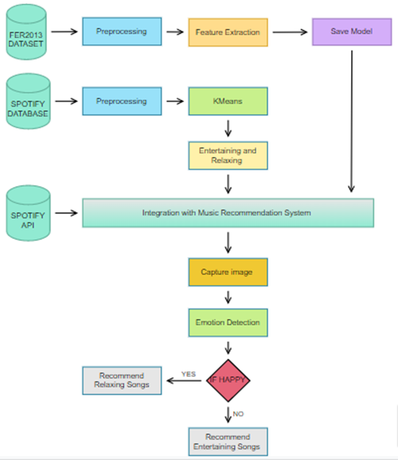
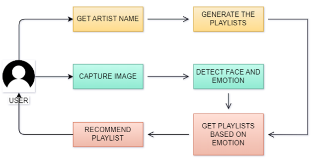
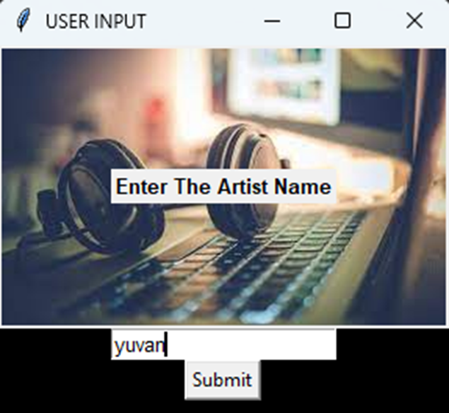
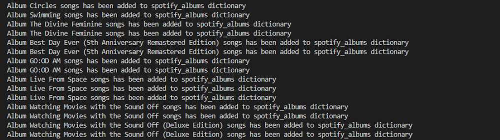

# Emotion-Based Music Recommendation System
 A music recommendation system based on Facial Emotions

# ABSTRACT
 This study describes a machine learning-based facial emotion-based music recommendation system connected to the Spotify API. Through a webcam, the system analyses the user's facial expressions and maps them to two fundamental emotions: happy and sad. The technology suggests a customized playlist of songs from the user's Spotify account based on the emotion identified. To make sure the suggested songs are in tune with the user's emotional state, the system uses the Spotify API to obtain user playlists, track information, and audio attributes like tempo, valence, and energy. The suggested technique can be applied as a cutting-edge tool to improve user experience and increase the efficiency of music recommendation systems.

# TECHNOLOGY USED
Python: The system is developed primarily using the Python programming language.
OpenCV: OpenCV (Open-Source Computer Vision Library) is used for facial detection and emotion recognition.
Last. fm API: The system is integrated with the Last.fm API to retrieve music data.
Scikit-learn: Scikit-learn is used for machine learning-based emotion recognition.
Flask: Flask is used as the web framework for the system.
HTML/CSS/JavaScript: The front end of the system is implemented using a combination of HTML, CSS, and JavaScript.
Spotify API for Developers: The Spotify API for developers is a set of web APIs and SDKs (Software Development Kits) that allow developers to integrate Spotify functionality into their applications. The Spotify API provides access to Spotify's vast music library, user data, and playlists, enabling developers to create music-related applications and services. The Spotify API offers various endpoints for accessing and manipulating data, such as retrieving track information, creating and modifying playlists, and searching for music. The API also supports OAuth 2.0 authentication, which allows developers to access user data and make changes to user accounts with their permission. In addition to the web API, Spotify also offers SDKs for various platforms, such as iOS, Android, and Web. These SDKs provide pre-built UI components and tools for integrating Spotify functionality into applications, making it easier for developers to create music-related applications without having to worry about the technical details of API integration.

### ARCHITECTURE
  

### FLOW DIAGRAM
  

### INTERFACE
  
  
  
  
  
